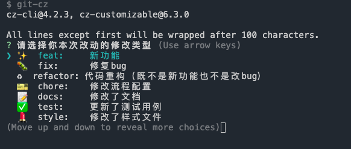
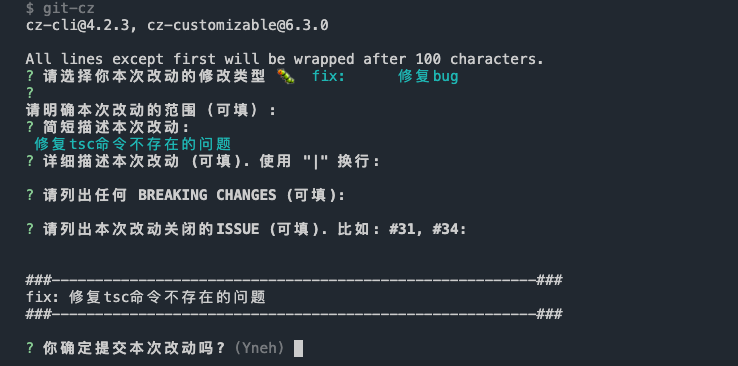

---
nav:
  title: RN开发项目模板
  path: /react-native
group:
  title: Template
  path: /rn-template
  order: 0
---

# React Native Template

github 地址：[react-native-template](https://github.com/thundersdata-frontend/rn-template)

react-native-template 是雷数前端团队基于以往 APP 的项目经验，积累沉淀下来的一套支撑 APP 快速开发的模板。内置了以下功能：

- [@td-design/react-native](https://github.com/thundersdata-frontend/td-design/tree/master/packages/react-native) 组件库
- [react-navigation](https://github.com/react-navigation/react-navigation) 作为 APP 导航
- [rc-field-form](https://github.com/react-component/field-form) 作为表单管理，获得跟 antd 一致的开发体验
- [react-error-boundary](https://github.com/bvaughn/react-error-boundary) + [react-native-exception-handler](https://github.com/a7ul/react-native-exception-handler) 异常处理
- [react-native-config](https://github.com/luggit/react-native-config) 用于区分不同的开发环境
- [react-native-reanimated](https://github.com/software-mansion/react-native-reanimated) + [react-native-redash](https://github.com/wcandillon/react-native-redash) 强大灵活的动画支持
- [swr](https://github.com/vercel/swr) 下一代数据请求方案
- [react-native-bootsplash](https://github.com/zoontek/react-native-bootsplash) 比 react-native-splash-screen 更好用的启动页工具
- [react-native-make](https://github.com/bamlab/react-native-make) 一行命令为应用生成图标
- [commitlint](https://github.com/conventional-changelog/commitlint) 更性感的 git 提交
- [jest](https://github.com/facebook/jest) + [testing-library](https://github.com/testing-library) 更强大的测试用例
- [detox](https://github.com/wix/Detox) 非常好用的自动化测试工具
- [pont](https://github.com/alibaba/pont) 基于后端 swagger 文档自动生成前端接口

我们将一一对以上功能做出更加详细的介绍。

## 新建项目

新建项目很简单，只需要几行简单的命令即可：

```code
npm install -g @td-design/cli

td-cli init <projectName>
根据提示，模板选择app、分支输入main即可
```

## 设置 APP 图标和启动页

有了`react-native-make`库的支持，实现修改图标的功能就变得非常简单。你只需要下面的一行代码即可实现：

```code
// app图标
react-native set-icon --path [path-to-image] --background "<background-color>"

// 启动页
react-native set-splash --path [path-to-image] --resize <[contain]|cover|center> --background "<background-color>"
```

## 配置不同的开发环境

通常在项目开发中我们会有很多不同的开发环境，比如 dev 环境，staging 环境，pre-UAT 环境，UAT 环境，production 环境等等，这些环境里面基础的代码部分基本上都是一样的。不同的地方更多的体现在环境的不同，比如各个环境连接的数据库不同，各个环境配置的环境变量、秘钥等参数不同。

以往我们会根据不同的分支来切换不同的环境，比如 develop 分支对应 dev 环境，master 分支对应 production 环境，等等。但是这种效果最大的问题是我们在开发的时候需要不停地在不同的分支进行切换，而且在分支很多的情况下，修复 bug，以及对应的代码合并操作非常繁琐而且很容易出现冲突甚至错误，导致开发效率低下，甚至严重时还会引起生产的 bug（切肤之痛！！！）。

那么除了用分支这种方式来管理不同的环境之外，还有其他更简单的方式来实现吗？

答案是有的。这就是这里要介绍的`react-native-config`。

在按照 readme 正确安装`react-native-config`之后，我们会在项目根目录下根据不同的环境新建几个`.env`的文件，比如:

- `.env` （需要有，以便在后面实现 IOS 上多环境切换的配置）
- `.env.dev` 对应开发环境
- `.env.staging` 对应测试环境
- `.env.production` 对应生产环境

每个文件中存放的内容的 key 值相同，但是 value 不同。比如：

```js
#这个参数在Android上用来比较两个版本哪个更新（值越大越新），在IOS上表示构建次数
VERSION_CODE=3

#这个参数在Android上表示用户看到的版本号，在IOS上表示Version
VERSION_NAME=1.1

#这个参数表示用户看到的APP的名字
APP_DISPLAY_NAME=rnTemplate

#后端API接口地址
authorization=http://authorization.thundersdata.com
```

配置完成后，那么 APP 在编译的时候是怎么知道该去读哪个环境变量配置文件呢？

### Android：

在`package.json`的`scripts`下新建几条命令：

```code
"android": "ENVFILE=.env.dev react-native run-android",
"android:staging": "cd ./android && ENVFILE=.env.staging ./gradlew app:assembleRelease",
"android:prod": "cd ./android && ENVFILE=.env.prod ./gradlew app:assembleRelease",
```

这样，通过`ENVFILE`我们就可以将我们需要对应的环境变量配置文件注入到开发或者打包命令中。

### IOS：

IOS 上的配置略显繁琐，具体步骤可以参见 readme 里面的步骤：

- [基础配置](https://github.com/luggit/react-native-config#availability-in-build-settings-and-infoplist)
- [多环境支持](https://github.com/luggit/react-native-config#ios-1)

## 处理页面间跳转

在应用中，我们选择使用`react-navigation`库来处理页面间跳转。更多信息可以参考[react-navigation 文档](https://reactnavigation.org/docs/getting-started)

## 处理表单提交

在应用中，我们选择使用`rc-field-form`作为表单解决方案。它是 ant-design 的 Form 组件的底层依赖，使用它可以让我们在开发上保证和 PC 上相同的写法，减少心智负担。示例如下：

```tsx | pure
import Form, { Field, useForm } from 'rc-field-form';

export default () => {
  const [form] = useForm();

  return (
    <Form
      component={false} // 在RN中使用，必须配置为false
      form={form}
      onFinish={values => {
        console.log('Finish:', values);
      }}
    >
      <Field name="username">
        <Input placeholder="Username" />
      </Field>
      <Field name="password">
        <Input placeholder="Password" />
      </Field>

      <button>Submit</button>
    </Form>
  );
};
```

更多组件信息请参考[API](https://github.com/react-component/field-form)

## 处理异常问题

异常处理问题一直是开发人员比较头疼的问题，尤其是在 APP 上表现得会更加严重，毕竟没有人会希望 APP 在使用过程中无故白屏或者崩溃。那么我们应该怎么优雅地处理 RN APP 中的异常问题呢？我们可以借助两个库来帮助我们实现更好的异常处理：

- react-error-boundary 处理 React 组件的异常问题
- react-native-exception-handler 处理 JavaScript 和原生模块的异常问题

先来介绍`react-error-boundary`。 `[ErrorBoundary](https://reactjs.org/docs/error-boundaries.html)`这个概念是在 React 16 中首次提出，它的主要目的是为了捕获组件在生命周期和渲染过程中出现的异常。`react-error-boundary`是基于`ErrorBoundary`的一个可复用组件，使用它包裹你要处理的组件，它会自动捕获这个组件以及它的所有子组件的异常，同时也提供一个好办法来恢复。在 RN APP 开发中，比较推荐的最佳实践是，用`react-error-boundary`包裹每一个导航页面，提供一个回退组件（出现异常时用来代替）来展示一个更友好的提示信息，也可以顺便提供一个重新刷新的功能尝试重新渲染该页面。

1. 封装一个全局的`ErrorHandler`组件：

```tsx | pure
import React, { FC } from 'react';
import { View, Text, Button } from 'react-native';
import { ErrorBoundary } from 'react-error-boundary';

function errorHandler(error: Error) {
  // 对error做处理，比如接入Sentry进行异常上报
  console.error(error);
}

function ErrorFallback({ resetErrorBoundary }) {
  return (
    <View>
      <Text>对不起，这个页面出问题了</Text>
      <Button title="重试" onPress={resetErrorBoundary} />
    </View>
  );
}

export const ErrorHandler: FC = ({ children }) => (
  <ErrorBoundary FallbackComponent={ErrorFallback} onError={errorHandler}>
    {children}
  </ErrorBoundary>
);
```

2. 在页面中使用：

```tsx | pure
import React from 'react';

export default HomepageScreen() {
  return (
    <ErrorHandler>
      <Container>
        <View>
          <Text>我是首页</Text>
        </View>
      </Container>
    </ErrorHandler>
  );
}
```

到目前为止，我们已经可以对组件的异常进行很好的处理，接下来我们来看看 JS 异常和原生模块异常我们应该怎么捕获。我们需要借助`react-native-exception-handler`。在项目根目录下的`index.js`里面添加以下代码：

```js
import { setJSExceptionHandler, setNativeExceptionHandler } from 'react-native-exception-handler';

setJSExceptionHandler((error, isFatal) => {
  // 在这里进行处理，比如做一个弹窗提示，或者把异常上报给sentry
});

setNativeExceptionHandler(nativeExceptionHandler, forceAppQuit, executeDefaultHandler);
```

## 优化 git 提交记录

一个比较好的 git 提交记录，应该明确地指出本次提交的目的，修改的内容，是否有相关的 issue 等。但是实际工作中大家对 git 提交记录重视不够，提交 message 随便写，导致后期在想要做诸如版本回退，版本切换等操作时，无法根据提交记录准确定位到具体某个提交。所以我们需要借助一些技术手段来让团队开发成员提交更加规范的 git 记录。同时，还可以做一些提交前的代码检查，运行测试用例等操作让提交的代码没有问题。这里需要借助以下几个库：

- husky -lint-staged
- commitlint -commitizen

具体配置信息可以查看以上库的说明，以及项目中的具体配置。最终的效果：

1. 执行`yarn commit`命令，会弹出以下界面：



根据提示一步一步操作，最后将看到以下界面：



输入 yes 后，程序自动执行 typescript 代码检查、eslint 代码检查、prettier 代码检查、运行测试用例，如果这些有任何一个失败了，则本次提交会自动失败。

## 测试用例

测试用例可以很好地保证我们编写的代码的正确性，防止出现线上问题。我们在实际开发过程中，需要根据需求的指导编写合适的测试用例来让我们编写的代码尽可能少地出现问题，尤其是逻辑缺失或者边界情况。这里我们推荐使用 jest 配合 testing-library 来编写测试用例。

1. 测试环境准备

请参考项目进行配置；

2. 编写测试用例

这里需要说明的是，对 UI 做测试的话，投入产出比不值得，因为 UI 层面的改动有时候会非常频繁，让我们的测试用例很难维护。我们应该尽可能多地对业务逻辑进行测试用例的编写，因为业务逻辑是相对固定的，不会出现经常变动的情况。而且，对业务逻辑的测试价值远远高于对 UI 界面的测试价值，逻辑的正确性和完备性的优先级要高于界面是否好看。所以，我们这里编写的测试用例都是针对业务逻辑的测试用例，同时因为我们要求把业务逻辑全部提取出来放到一个单独的文件中维护，和 UI 解耦，在 react 中，这种实现就是基于 hooks 来做，所以这里说的针对业务逻辑的测试用例，实际上也就是对自定义 hooks 的测试用例。包括以下几个测试场景：

### 1. 普通 hooks

```ts | pure
// 自定义hooks
export default function useCounter() {
  const [count, setCount] = useState(0);
  const increment = useCallback(() => setCount(x => x + 1), []);

  return { count, increment };
}

// 测试用例
import { renderHook, act } from '@testing-library/react-hooks';
import useCounter from './useCounter';

test('should use counter', () => {
  const { result } = renderHook(() => useCounter());

  expect(result.current.count).toBe(0);
  expect(typeof result.current.increment).toBe('function');
});

test('should increment counter', () => {
  const { result } = renderHook(() => useCounter());

  act(() => {
    result.current.increment();
  });

  expect(result.current.count).toBe(1);
});
```

`renderHook`和`act`的相关用法请查看`@testing-library/react-hooks`的 API

### 2. 接收参数的 hooks

```ts | pure
// 自定义hooks
export default function useCounterWithProps(initialValue = 0) {
  const [count, setCount] = useState(initialValue);

  const increment = useCallback(() => setCount(x => x + 1), []);

  const reset = useCallback(() => setCount(initialValue), [initialValue]);

  return { count, increment, reset };
}

// 测试用例
import { renderHook, act } from '@testing-library/react-hooks';
import useCounterWithProps from './useCounterWithProps';

test('should increment counter from custom initial value', () => {
  const { result } = renderHook(() => useCounterWithProps(9000));

  act(() => {
    result.current.increment();
  });

  expect(result.current.count).toBe(9001);
});

test('should reset counter to updated initial value', () => {
  const { result, rerender } = renderHook(({ initialValue }) => useCounterWithProps(initialValue), {
    initialProps: {
      initialValue: 0,
    },
  });

  rerender({ initialValue: 10 });

  act(() => {
    result.current.reset();
  });

  expect(result.current.count).toBe(10);
});
```

### 3. 使用了 context 的 hooks

```ts | pure
// 自定义hooks
import React, { useState, useContext, useCallback } from 'react';

const CounterContext = React.createContext(1);

export const CounterProvider = ({ step, children }: { children?: React.ReactNode; step: number }) => (
  <CounterContext.Provider value={step}>{children}</CounterContext.Provider>
);

export function useContextCounter(initialValue = 0) {
  const [count, setCount] = useState(initialValue);

  const step = useContext(CounterContext);

  const increment = useCallback(() => setCount(x => x + step), [step]);

  const reset = useCallback(() => setCount(initialValue), [initialValue]);

  return { count, increment, reset };
}

// 测试用例
import React from 'react';
import { renderHook, act } from '@testing-library/react-hooks';
import { CounterProvider, useContextCounter } from './useContextCounter';

test('should use custom step when incrementing', () => {
  const wrapper = ({ children }: { children?: React.ReactNode }) => (
    <CounterProvider step={2}>{children}</CounterProvider>
  );

  const { result } = renderHook(() => useContextCounter(), { wrapper });

  act(() => {
    result.current.increment();
  });

  expect(result.current.count).toBe(2);
});

test('should use custom step when incrementing', () => {
  const wrapper = ({ step, children }: { children?: React.ReactNode; step: number }) => (
    <CounterProvider step={step}>{children}</CounterProvider>
  );

  const { result, rerender } = renderHook(() => useContextCounter(), {
    wrapper,
    initialProps: { step: 2 },
  });

  act(() => {
    result.current.increment();
  });

  expect(result.current.count).toBe(2);

  rerender({ step: 8 });

  act(() => {
    result.current.increment();
  });

  expect(result.current.count).toBe(10);
});
```

### 4. 使用了异步处理的 hooks

```ts | pure
// 自定义hooks
import { useState, useCallback } from 'react';

export default function useAsyncCounter(initialValue = 0) {
  const [count, setCount] = useState(initialValue);

  const increment = useCallback(() => setCount(x => x + 1), []);

  const incrementAsync = useCallback(() => setTimeout(increment, 200), [increment]);

  return {
    count,
    incrementAsync,
  };
}

// 测试用例
import { renderHook, act } from '@testing-library/react-hooks';
import useAsyncCounter from './useAsyncCounter';

describe('useAsyncCounter', () => {
  beforeAll(() => {
    jest.useFakeTimers();
  });

  test('should increment counter after delay', async () => {
    const { result } = renderHook(() => useAsyncCounter());

    result.current.incrementAsync(); // async不需要放在act里

    act(() => {
      jest.runAllTimers();
    });

    expect(result.current.count).toBe(1);
  });
});
```

## 前后端接口联调

在实际项目中使用 pont，让我们获得的最大好处就是极大地提高了前后端在接口联调上的效率。pont 可以基于后端生成的 swagger 文档和我们定制的模板文件，自动为我们生成后端接口定义文件以及相应的类型声明文件和初始值。在后端接口发生改变的时候，pont 也可以自动感知到变化，借助 vscode 的 pont 插件，可以非常方便地同步这些改变生成新的文件，保持前端接口文件和类型声明跟后端接口、字段的一致性。这样一来，前后端之间最大的沟通成本就得到了解决。

pont 使用的最佳实践：

1. 尽可能多地复用 pont 自动生成的类型声明文件，不要自己定义。我们可以借助 typescript 提供的`Utility Types(工具类型)`来尽可能复用已有的类型。例如：

```ts | pure
export type PolicyDetailDTO = Pick<
  defs.gazelle.PolicyDTO,
  | 'policyId'
  | 'policyType'
  | 'title'
  | 'indexCode'
  | 'issueNumber'
  | 'issueOrg'
  | 'subjectType'
  | 'subjectWord'
  | 'tenantCode'
> & {
  issueDate: moment.Moment;
  finalDate: moment.Moment;
  attachment?: UploadFile[];
};
```

2. 不要自己定义初始值，直接使用 pont 生成的 init 值。例如：

```ts | pure
const [detail, setDetail] = useState<defs.gazelle.CompanyFinancialIndicatorDTO>(
  API.gazelle.companyFinancialIndicator.getById.init
);
```

3. 使用`swr`来执行所有的`GET`类型的接口调用。其他类型的接口直接走 pont 生成的接口本身。例如：

```ts | pure
// GET 类型的请求走useSWR
const { path, fetch } = API.gazelle.companyFinancialIndicator.getById;
const { data, error, isValidating } = useSWR<defs.gazelle.CompanyFinancialIndicatorDTO>(path, fetch);

// 其他类型的请求直接调用胶水代码
const handleSubmit = async () => {
  try {
    const result = await API.gazelle.companyFinancialIndicator.save();
  } catch (error) {
    console.error(error);
  }
};
```
