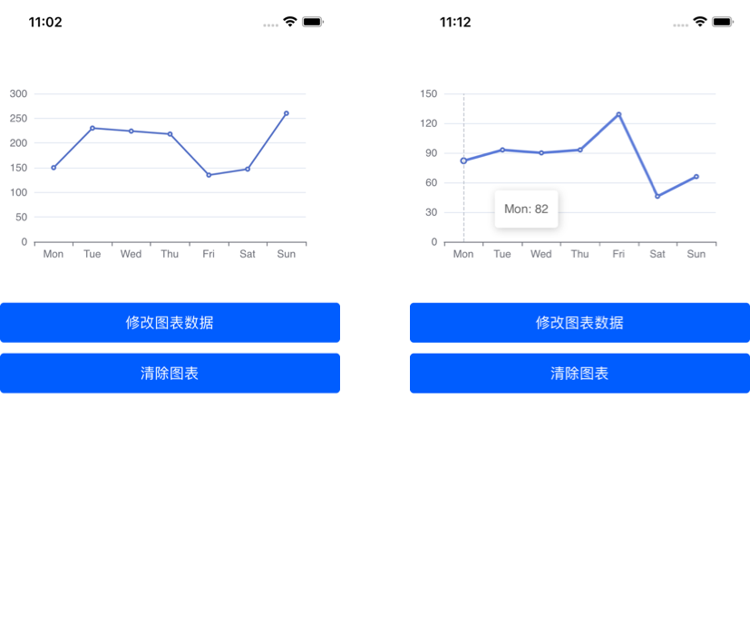
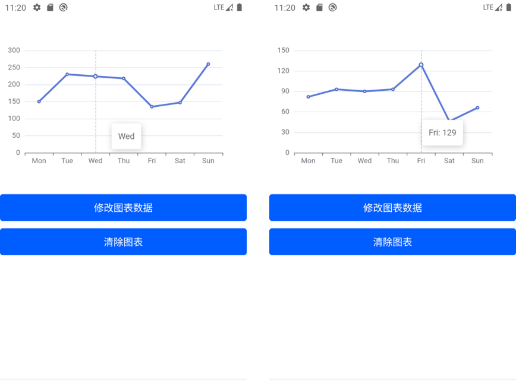

# react-native-echarts

在 react-native 项目中使用 echarts 展示图表

- IOS 效果图



- Android 效果图



## 特点

**基于最新的 echarts 版本**

**支持开启 hermes**

## 使用

```code
yarn add react-native-webview @td-design/react-native-echarts
```

## 示例

### 1. 获取数据后显示图表

```jsx
import React, { FC, useEffect, useRef } from 'react';
import { View } from 'react-native';
import Echarts, { EchartsHandler } from '@td-design/react-native-echarts';

export default () => {
  const chart = useRef<EchartsHandler>(null);

  // setOption after data fetch
  useEffect(() => {
    fetch(xxx).then(data => {
      chart.current?.setOption({
        tooltip: {
          trigger: 'axis',
          formatter: `function (params) {
            if (Array.isArray(params)) {
              return params[0].name;
            }
            return params.name;
          }`,
        },
        xAxis: {
          type: 'category',
          // data: ['Mon', 'Tue', 'Wed', 'Thu', 'Fri', 'Sat', 'Sun'],
          data: data.xAxis,
        },
        yAxis: {
          type: 'value',
        },
        series: [
          {
            // data: [150, 230, 224, 218, 135, 147, 260],
            data: data.seriesData,
            type: 'line',
          },
        ],
      });
    })
  }, []);

  return (
    <View style={{ flex: 1 }}>
      <Echarts ref={chart}>
    </View>
  );
}
```

### 2. 修改图表

```jsx
import React, { FC, useEffect, useRef } from 'react';
import { View, Button } from 'react-native';
import Echarts, { EchartsHandler } from '@td-design/react-native-echarts';

export default () => {
  const chart = useRef<EchartsHandler>(null);

  // setOption after data fetch
  useEffect(() => {
    fetch(xxx).then(data => {
      chart.current?.setOption({
        tooltip: {
          trigger: 'axis',
          formatter: `function (params) {
            if (Array.isArray(params)) {
              return params[0].name;
            }
            return params.name;
          }`,
        },
        xAxis: {
          type: 'category',
          // data: ['Mon', 'Tue', 'Wed', 'Thu', 'Fri', 'Sat', 'Sun'],
          data: data.xAxis,
        },
        yAxis: {
          type: 'value',
        },
        series: [
          {
            // data: [150, 230, 224, 218, 135, 147, 260],
            data: data.seriesData,
            type: 'line',
          },
        ],
      });
    })
  }, []);

  // modify chart option
  const modifyOptions = () => {
    chart.current?.setOption({
      tooltip: {
        trigger: 'axis',
        formatter: `function (params) {
          if (Array.isArray(params)) {
            return params[0].name + ": " + params[0].data;
          }
          return params.name + ": " + params.data;
        }`,
      },
      xAxis: {
        type: 'category',
        data: ['Mon', 'Tue', 'Wed', 'Thu', 'Fri', 'Sat', 'Sun'],
      },
      yAxis: {
        type: 'value',
      },
      series: [
        {
          data: [82, 93, 90, 93, 129, 46, 66],
          type: 'line',
        },
      ],
    });
  };

  return (
    <View style={{ flex: 1 }}>
      <Echarts ref={chart}>
      <Button title="modify chart" onPress={modifyOptions} />
    </View>
  );
}
```

### 3. 清除图表

```jsx
import React, { FC, useEffect, useRef } from 'react';
import { View, Button } from 'react-native';
import Echarts, { EchartsHandler } from '@td-design/react-native-echarts';

export default () => {
  const chart = useRef<EchartsHandler>(null);

  // setOption after data fetch
  useEffect(() => {
    fetch(xxx).then(data => {
      chart.current?.setOption({
        tooltip: {
          trigger: 'axis',
          formatter: `function (params) {
            if (Array.isArray(params)) {
              return params[0].name;
            }
            return params.name;
          }`,
        },
        xAxis: {
          type: 'category',
          // data: ['Mon', 'Tue', 'Wed', 'Thu', 'Fri', 'Sat', 'Sun'],
          data: data.xAxis,
        },
        yAxis: {
          type: 'value',
        },
        series: [
          {
            // data: [150, 230, 224, 218, 135, 147, 260],
            data: data.seriesData,
            type: 'line',
          },
        ],
      });
    })
  }, []);

  // clear chart
  const clearChart = () => {
    chart.current?.clear();
  };

  return (
    <View style={{ flex: 1 }}>
      <Echarts ref={chart}>
      <Button title="clear chart" onPress={clearChart} />
    </View>
  );
}
```

## 属性

| 属性            | 必填    | 说明           | 类型     | 默认值   |
| --------------- | ------- | -------------- | -------- | -------- |
| width           | `false` | 图表宽度       | `number` | 屏幕宽度 |
| height          | `false` | 图表高度       | `number` | `300`    |
| backgroundColor | `false` | 图表背景色     | `string` | `#fff`   |
| extraCode       | `false` | 额外注入的代码 | `string` | ``       |

## 方法

| 方法                 | 说明           |
| -------------------- | -------------- |
| `setBackgroundColor` | 修改背景色     |
| `getOption`          | 获取图表配置项 |
| `setOption`          | 修改图表配置项 |
| `clear`              | 清除图表       |

## Q&A

- Q: 安卓上无法显示图表
- A: 安卓上需要把`node_modules/@td-design/react-native-echarts/lib/commonjs/tmp/tpl.html` 文件复制到`android/app/src/main/assets/`目录下。
